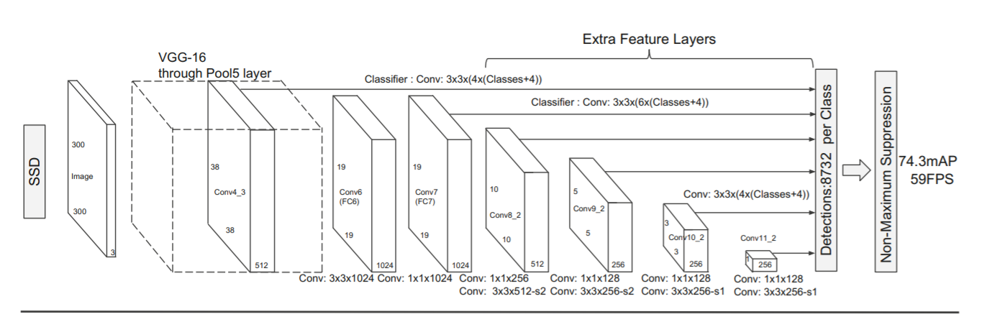
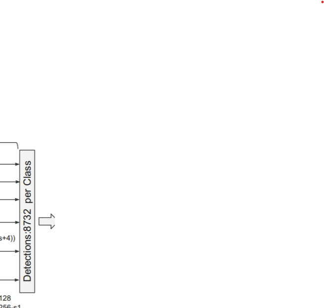
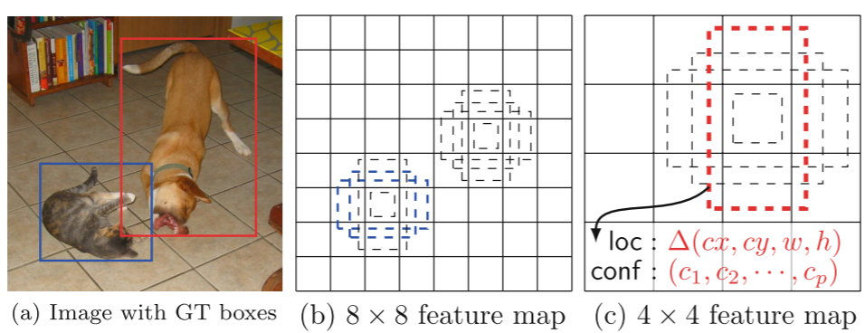
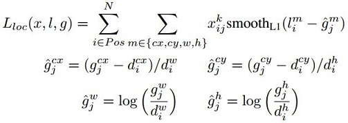
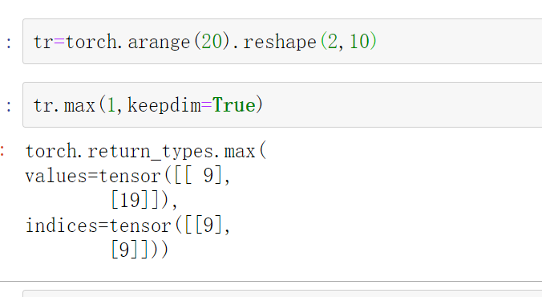

### SSD:single shot MultiBox Detector(单发多框检测器)

 SSD通过在每张特征图的位置，将输出的bbox离散成一系列默认的不同ratio和scale方框。在预测中，网络产生每个物体种类存在的可能性并且对方框作出调整来更好的适配物体的形状。另外，网络整合了拥有这不同的空间分辨率的特征图来更好地预测不同尺寸的物体，SSD 相对于需要的方法简单，通过object prosal，因为它完全消除了生成的建议以及随后的像素或特征重采样阶段并封装所有计算过程在单个网络中进行计算。




##### 空洞卷积


图像分割中一般按照传统的CNN中，利用CNN不断的Pooling 后降低对应的size最后经过转置卷积进行上采样，回到原始的图片的size的大小，b图是kernel_szie=(3$\times 3$​)dilation=2对应的实际上kernelWie7*7，除了几个对应的参数权重不为-其余权重全为0。

dilated的好处是不做pooling损失信息的情况下，加大了感受野，让每个卷积输出都包含较大范围的信息。在图像需要全局信息或者语音文本需要较长的sequence信息依赖的问题中，都能很好的应用dilated conv，dilated conv结构，可以更形象的了解dilated conv本身。

整体的网络架构在这里

- backbone:VGG-16 ,5和pooling layer conv5之后pooling的stride=1，也就是可以保存特征图的大小，Conv6使用了diltation=6的空洞卷积，padding=6也增加感受野之后保持特征图的尺寸保持不变

  输入图片的尺寸为$300\times300$​,输出之后的为$300$​VGG16的前13个卷积层进行对应的处理

  conv6 3*3 1024 conv 7 3\*3 1024  conv8_2 3\*3 512 conv8_1 1\*1 256 conv9_2 3\*3 256 对应的channel

  

  

  回到这里，让我们重新计算一下

  input_size=(300,300)

  conv4_3没有经过池化层所以输出为(38,38),3个池化层 2^3

  出VGG的基本框架之后，总共是4个缩小尺寸的kernel 2^4 输出的size为(19,19),接下来就是正常的池化和和maxpooling改变对应的channels,

  回到对应的代码来进行解释

  ```python
  """
  input-> conv1_2:3x3x64,relu,3x3x64,relu -> pool1 -> 
  		conv2_2:3x3x128,relu,3x3x128,relu -> pool2 ->
  		conv3_3:3x3x256,relu,3x3x256,relu,3x3x256,relu -> pool3 ->
  		conv4_3:3x3x512,relu,3x3x512,relu,3x3x512,relu -> pool4 ->
  		conv5_3:3x3x512,relu,3x3x512,relu,3x3x512,relu -> pool5 ->
  		conv6:3x3x1024 atrous，relu-> 
  		conv7:1x1x1024，relu
  		vgg_base = {
      '300': [64, 64, 'M', 128, 128, 'M', 256, 256, 256, 'C', 512, 512, 512, 'M',
              512, 512, 512],
      '512': [64, 64, 'M', 128, 128, 'M', 256, 256, 256, 'C', 512, 512, 512, 'M',
              512, 512, 512],
  }
  """
  # 如果是M则添加最大pooling层来进行高宽减半的方法，默认的Batch为false,如果为True在卷积层输出的时候跟着BN层和Relu，激活函数，in
  #inplace=True用来减少内存，in_channels=v支持后边的网络
  def add_vgg(cfg, batch_norm=False):
      layers = []
      in_channels = 3
      for v in cfg:
          if v == 'M':
              layers += [nn.MaxPool2d(kernel_size=2, stride=2)]
          elif v == 'C':
              layers += [nn.MaxPool2d(kernel_size=2, stride=2, ceil_mode=True)]
          else:
              conv2d = nn.Conv2d(in_channels, v, kernel_size=3, padding=1)
              if batch_norm:
                  layers += [conv2d, nn.BatchNorm2d(v), nn.ReLU(inplace=True)]
              else:
                  layers += [conv2d, nn.ReLU(inplace=True)]
              in_channels = v
      pool5 = nn.MaxPool2d(kernel_size=3, stride=1, padding=1)#不进行下采样的处理
      conv6 = nn.Conv2d(512, 1024, kernel_size=3, padding=6, dilation=6)#加上的conv6采用扩展卷积或带孔卷积（Dilation Conv），其在不增加参数与模型复杂度的条件下指数级扩大卷积的视野
      #，采用 3x3 大小但dilation rate=6的扩展卷积。conv7采用1x1的卷积,
      conv7 = nn.Conv2d(1024, 1024, kernel_size=1)#实际上是全连接层用1*1卷积得以替代
      layers += [pool5, conv6,
                 nn.ReLU(inplace=True), conv7, nn.ReLU(inplace=True)]
  ```

  

- extra feature layers

  conv8_1 1\*1 256  conv8_2 3\*3 512     conv9_1 1\*1 128 conv9_2 3\*3 256 对应的channel

  conv10_1 1\*1 128 conv10_2 3\*3 256channel  conv11_1 1\*1 128 channels  conv11_2 3\*3 256 channel

  注意这里没有多余的池化层的关系

  

  ```python
  """
  feature -> conv8_2:1x1x256,3x3x512s2 -> conv9_2:1x1x128,3x3x256s2 ->
  		   conv10_2:1x1x128,3x3x256s1 -> conv11_2:1x1x128,3x3x256s1
  		   extras_base = {
      '300': [256, 'S', 512, 128, 'S', 256, 128, 256, 128, 256],
      '512': [256, 'S', 512, 128, 'S', 256, 128, 'S', 256, 128, 'S', 256],
  
  
  """
  #这里面s的设计用来进行对应的stride
  def add_extras(cfg, i, size=300):
      # Extra layers added to VGG for feature scaling
      layers = []
      in_channels = i
      flag = False#0和1调整第一个和第二个
      for k, v in enumerate(cfg):
          if in_channels != 'S':#调整由于字符串产生的结果
              if v == 'S':
                  layers += [nn.Conv2d(in_channels, cfg[k + 1], kernel_size=(1, 3)[flag], stride=2, padding=1)]
              else:
                  layers += [nn.Conv2d(in_channels, v, kernel_size=(1, 3)[flag])]
              flag = not flag
          in_channels = v
      if size == 512:#如果对应的s
          layers.append(nn.Conv2d(in_channels, 128, kernel_size=1, stride=1))
          layers.append(nn.Conv2d(128, 256, kernel_size=4, stride=1, padding=1))
      return layers
  
  #config对应
  ```

  

- 多尺度检测特征图

  添加卷积特征层到截断的基础网络的末端，截断的网络层次在下面的结构中存在，减少了计算量(类似于NIN块中)用$1\times1$卷积块来代替全连接层的存在,，可以实现多尺度检测的预测

- 每个被添加的特征层(选择性从基本的网络中存在的额外的特征层)可以产生一系列固定的检测预测输出,一个特征层的shape$m\times n$​​​​​​，channels数对应的p,P个卷积核的kernel_size=(3,3) ，会产生检测框的类别或者位置的相关信息(类别的相关信息，是各个检测框的softmax的分类得分score，对应的位置信息则是prior box和ground truth box的offset 文章中用conf来表示)，SSD文章中的上述利用卷积层来代替FC层的存在

- 

- 默认框和横纵比

  这个思想其实和Faster RCNN中的anchor的思想很一致，通过在特征图中每一个pixel的中心处生成scale和ratio不同的先验框，根据论文中事先设计的超参数的来获得default box的ratio和scale,对于每个预测框预测对应的刚才的score和offsets

  每个对应的feature map中的cell会产生k个prior box,共有C类classes,和conf中的4个offsets，每个cell中输出的channel(C+4)$\times$​k个filter,对于特征图shape为$(m,n)$对应的输出为$m\times n\times(c+4)$​对应输出的channels，其实和Faster RCNN很像了，但是SSD可以通过多个特征图来对应符合不同size的物体

  在前面的anchor cobv4 conv7 conv 8 conv 9  conv10 conv11中对应的prior box的数量分别4 6 6 4 4个prior box

  每一层后跟着



#### Training

SSD的Ground truth information 需要分配到固定上文提到的检测器的输出。目的的就是检测框和GT boxes相匹配和对应，一旦这个matching 的任务完后才能，就可以进行端到端反向传播等等。

##### matching

gtbox和default box匹配的方法就是计算对应的IOU，匹配对应的default box的阈值为0.5，简化了学习的的过程，并且预先网络预测大量重叠的default box对应的分类得分，而不是仅仅选择最大的IOU所对应的一个框

##### train objectives

损失函数$\alpha$​​用来调整对应的confidence loss 和location loss之间的比例，默认为1

$x_{ij}^p$​​代表着第i个default box 匹配上第j个所属class为p的ground truth,剩下的部分类似于Faster RCNN 中的策略
$$
L(x,c,l,g)=\frac{1}{N}(L_{conf}(x,c)+\alpha L_{loc}(x,l,g))
$$


​                                            

```python
def encode(matched, priors, variances):
    """Encode the variances from the priorbox layers into the ground truth boxes
    we have matched (based on jaccard overlap) with the prior boxes.
    Args:
        matched: (tensor) Coords of ground truth for each prior in point-form
            Shape: [num_priors, 4].
        priors: (tensor) Prior boxes in center-offset form
            Shape: [num_priors,4].
        variances: (list[float]) Variances of priorboxes
    Return:
        encoded boxes (tensor), Shape: [num_priors, 4]
    """
    # matched  gt box xmin ymin xmax ymax
    # prior box  cx cy w h
    # dist b/t match center and prior's center
    g_cxcy = (matched[:, :2] + matched[:, 2:])/2 - priors[:, :2]
    # encode variance
    g_cxcy /= (variances[0] * priors[:, 2:])
    # match wh / prior wh
    g_wh = (matched[:, 2:] - matched[:, :2]) / priors[:, 2:]
    g_wh = torch.log(g_wh) / variances[1]
    # return target for smooth_l1_loss
    return torch.cat([g_cxcy, g_wh], 1)  # [num_priors,4]
```

上述四个公式在这里，上述的

##### Faster RCNN boudning Regression

上述的g代表镇Faster RCNN 中 d为default box,g 代表着ground truth box中的结果

给定一组的default box $ d=(d_{cx},d_{cy},d_w,d_h)$和一组Ground truth $ GT=(g_x,g_y,g_w,g_h)$​ 找到一组线性变换满足，可以使得default box近似于​对应的Ground truth的数据，可以进行平行和缩放的处理
$$
G’_x=d_w l_x(d)+d_x
$$

$$
G'_w=d_w exp(l_w(d))
$$

所以当前需要的就是几个线性变换的参数$L_*$​​代指各个x,y,w,h等四个变换如何获得对应，所以利用线性回归的方法计算$Y=w_*^T d_*$​​​​d_*代表着feature map中的特征向量计算上述公式的$l^i$​

上述的部分在这里

```python
def decode(loc, priors, variances):
    """Decode locations from predictions using priors to undo
    the encoding we did for offset regression at train time.
    Args:
        loc (tensor): location predictions for loc layers,
            Shape: [num_priors,4]
        priors (tensor): Prior boxes in center-offset form.
            Shape: [num_priors,4].
        variances: (list[float]) Variances of priorboxes
    Return:
        decoded bounding box predictio ns
    """

    boxes = torch.cat((
        priors[:, :2] + loc[:, :2] * variances[0] * priors[:, 2:],
        priors[:, 2:] * torch.exp(loc[:, 2:] * variances[1])), 1)
    boxes[:, :2] -= boxes[:, 2:] / 2
    boxes[:, 2:] += boxes[:, :2]
    """
    后面这部分代码是将(cx,cy,h,w)->(xmin,ymin,xmax,ymax)的过程
    """
    return boxes

```


#####  hard negative mining

$$
Recall=\frac{TP}{TP+FN}
$$


目标检测与图像分类不同，图像分类往往只有一个输出，但目标检测的输出个数却是未知的。除了Ground-Truth（标注数据）训练时，**模型永远无法百分百确信自己要在一张图上预测多少物体**。SSD中大量的负样本，但此时就会遇到一个问题，因为区域提议实在太多，导致在训练时绝大部分都是负样本，这导致了大量无意义负样本的梯度“淹没”了有意义的正样本。需要用方法抑制大量的简单负样本，挖掘所有Hard example 的特征。

难负例挖掘（Hard Negative Mining）就是在训练时，尽量多挖掘些难负例（hard negative)加入负样本集，这样会比easy negative组成的负样本集效果更好。

```python
# -*- coding: utf-8 -*-
import torch
import torch.nn as nn
import torch.nn.functional as F
from data import voc as cfg
from ..box_utils import match, log_sum_exp


class MultiBoxLoss(nn.Module):
    """SSD Weighted Loss Function
    Compute Targets:
        1) Produce Confidence Target Indices by matching  ground truth boxes
           with (default) 'priorboxes' that have jaccard index > threshold parameter
           (default threshold: 0.5).
        2) Produce localization target by 'encoding' variance into offsets of ground
           truth boxes and their matched  'priorboxes'.
        3) Hard negative mining to filter the excessive number of negative examples
           that comes with using a large number of default bounding boxes.
           (default negative:positive ratio 3:1)
    Objective Loss:
        L(x,c,l,g) = (Lconf(x, c) + αLloc(x,l,g)) / N
        Where, Lconf is the CrossEntropy Loss and Lloc is the SmoothL1 Loss
        weighted by α which is set to 1 by cross val.
        Args:
            c: class confidences,
            l: predicted boxes,
            g: ground truth boxes
            N: number of matched default boxes
        See: https://arxiv.org/pdf/1512.02325.pdf for more details.
    """

    def __init__(self, num_classes, overlap_thresh, prior_for_matching,
                 bkg_label, neg_mining, neg_pos, neg_overlap, encode_target,
                 use_gpu=True):
        super(MultiBoxLoss, self).__init__()
        self.use_gpu = use_gpu
        self.num_classes = num_classes
        self.threshold = overlap_thresh
        self.background_label = bkg_label
        self.encode_target = encode_target
        self.use_prior_for_matching = prior_for_matching
        self.do_neg_mining = neg_mining
        self.negpos_ratio = neg_pos
        self.neg_overlap = neg_overlap

        #import pdb
        #pdb.set_trace()

        self.variance = cfg['variance']

    def forward(self, predictions, targets):
        """Multibox Loss
        Args:
            predictions (tuple): A tuple containing loc preds, conf preds,
            and prior boxes from SSD net.
                conf shape: torch.size(batch_size,num_priors,num_classes)
                loc shape: torch.size(batch_size,num_priors,4)
                priors shape: torch.size(num_priors,4)

            targets (tensor): Ground truth boxes and labels for a batch,
                shape: [batch_size,num_objs,5] (last idx is the label).
        """

        loc_data, conf_data, priors = predictions
        num = loc_data.size(0)#对应的batch size
        priors = priors[:loc_data.size(1), :]
        num_priors = (priors.size(0))
        num_classes = self.num_classes

        # match priors (default boxes) and ground truth boxes
        # 1 首先匹配正负样本
        loc_t = torch.Tensor(num, num_priors, 4)
        conf_t = torch.LongTensor(num, num_priors)
        for idx in range(num):
            truths = targets[idx][:, :-1].data#前面的的是GT Box 四个坐标
            labels = targets[idx][:, -1].data#后面是对应的label
            defaults = priors.data
            # 得到每一个prior对应的truth,放到loc_t与conf_t中,conf_t中是类别,loc_t中是[matches, prior, variance]
            match(self.threshold, truths, defaults, self.variance, labels,
                  loc_t, conf_t, idx)#获得对应的匹配，并encode之后，这里使用的都是类内的变量，无须返回相应的值
        if self.use_gpu:
            loc_t = loc_t.cuda()
            conf_t = conf_t.cuda()
        # wrap targets

        # 2 计算所有正样本的定位损失,负样本不需要定位损失

        # 计算正样本的数量
        pos = conf_t > 0
        num_pos = pos.sum(dim=1, keepdim=True)

        #import pdb
        #pdb.set_trace()
        #根据前文的multibox生成的8732个对应的anchor

        # Localization Loss (Smooth L1)
        # Shape: [batch,num_priors,4]
        # 将pos_idx扩展为[32, 8732, 4],正样本的索引
        pos_idx = pos.unsqueeze(pos.dim()).expand_as(loc_data)
        
        # 正样本的定位预测值
        loc_p = loc_data[pos_idx].view(-1, 4)
        # 正样本的定位真值
        loc_t = loc_t[pos_idx].view(-1, 4)
        # 所有正样本的定位损失
        loss_l = F.smooth_l1_loss(loc_p, loc_t, size_average=False)

        # 3 对于类别损失,进行难样本挖掘,控制比例为1:3

        # Compute max conf across batch for hard negative mining
        # 所有prior的类别预测
        batch_conf = conf_data.view(-1, self.num_classes)
        # 计算类别损失.每一个的log(sum(exp(21个的预测)))-对应的真正预测值
        loss_c = log_sum_exp(batch_conf) - batch_conf.gather(1, conf_t.view(-1, 1))

        # Hard Negative Mining
        loss_c = loss_c.view(pos.size()[0], pos.size()[1])
        # 首先过滤掉正样本
        loss_c[pos] = 0  # filter out pos boxes for now
        loss_c = loss_c.view(num, -1)
        _, loss_idx = loss_c.sort(1, descending=True)
        # idx_rank为排序后每个元素的排名
        _, idx_rank = loss_idx.sort(1)
        num_pos = pos.long().sum(1, keepdim=True)

        # 这个地方负样本的最大值不应该是pos.size(1)-num_pos?
        num_neg = torch.clamp(self.negpos_ratio*num_pos, max=pos.size(1)-1)
        # 选择每个batch中负样本的索引
        neg = idx_rank < num_neg.expand_as(idx_rank)

        # 4 计算正负样本的类别损失

        # Confidence Loss Including Positive and Negative Examples
        # 都扩展为[32, 8732, 21]
        pos_idx = pos.unsqueeze(2).expand_as(conf_data)
        neg_idx = neg.unsqueeze(2).expand_as(conf_data)
        # 把预测提出来
        conf_p = conf_data[(pos_idx+neg_idx).gt(0)].view(-1, self.num_classes)
        # 对应的标签
        targets_weighted = conf_t[(pos+neg).gt(0)]
        loss_c = F.cross_entropy(conf_p, targets_weighted, size_average=False)

        # Sum of losses: L(x,c,l,g) = (Lconf(x, c) + αLloc(x,l,g)) / N

        N = num_pos.data.sum()
        loss_l /= N.type('torch.cuda.FloatTensor')
        loss_c /= N.type('torch.cuda.FloatTensor')
        return loss_l, loss_c

```


##### scale和aspect ratio的设计方式

使用较低和较高的特征图用于检测，m的大小根据特征图的种类来
$$
s_k=s_{min}+\frac{s_{max}-s_{min}}{m-1},k\in(1,m)
$$

$$
s_min=0.2,s_{max}=0.9
$$
这样各个层之间的scale设计就已经很清楚了

##### ratio

$$
a_r=\{1,2,3,\frac{1}{3},\frac{1}{2}\}
$$

计算对应的prior box的高宽对应的公式为
$$
w_k=s_k\sqrt{a_r},h_k^{\alpha}=\frac{s_k}{a_r}
$$
当对应的ratio为1 的时候，默认框的scale为下面的公式$sk^‘=\sqrt{s_ks_{k+1}}$，default box的建议框的中心是各个feature map 像素点的中心。

通过结合特征图不同尺度的scale以及对应高宽比的默认框，我们一系列大量不同的预测值，覆盖大量范围的尺寸。


- 在一个feature map中输出的类别图像的channels （num_classes*num_priorbox,layer_height,layer_width]的特征进行softmax后的大奥对应的分类得分

- 位置对应regression的CNN输出的$(4\times 先验框)$​

  

```python
class PriorBox(object):#先验框生成对应的
    """Compute priorbox coordinates in center-offset form for each source
    feature map.
    """
    def __init__(self, cfg):
        super(PriorBox, self).__init__()
        self.image_size = cfg['min_dim']
        # number of priors for feature map location (either 4 or 6)
        self.num_priors = len(cfg['aspect_ratios'])
        self.variance = cfg['variance'] or [0.1]
        self.feature_maps = cfg['feature_maps']
        self.min_sizes = cfg['min_sizes']
        self.max_sizes = cfg['max_sizes']
        self.steps = cfg['steps']
        self.aspect_ratios = cfg['aspect_ratios']
        self.clip = cfg['clip']
        self.version = cfg['name']
        for v in self.variance:
            if v <= 0:
                raise ValueError('Variances must be greater than 0')

    # 生成所有的PriorBox，需要每一个特征图的信息
    def forward(self):
        mean = []
        for k, f in enumerate(self.feature_maps):#前面6层的特征图
            for i, j in product(range(f), repeat=2):#获取对应的笛卡尔的及
                # f_k为每个特征图的尺寸
                f_k = self.image_size / self.steps[k]#获取对应的特征图的尺寸
                # 求取每个box的中心坐标
                cx = (j + 0.5) / f_k
                cy = (i + 0.5) / f_k

                # 对应{S_k, S_k}大小的PriorBox
                s_k = self.min_sizes[k]/self.image_size
                mean += [cx, cy, s_k, s_k]#第一个正方形对应anchor
				
                # 对应{√(S_k S_(k+1) ), √(S_k S_(k+1) )}大小的PriorBox
                s_k_prime = sqrt(s_k * (self.max_sizes[k]/self.image_size))
                mean += [cx, cy, s_k_prime, s_k_prime]

                # 剩余的比例为2、1/2、3、1/3的PriorBox
                for ar in self.aspect_ratios[k]:
                    mean += [cx, cy, s_k*sqrt(ar), s_k/sqrt(ar)]
                    mean += [cx, cy, s_k/sqrt(ar), s_k*sqrt(ar)]
        # back to torch land
        output = torch.Tensor(mean).view(-1, 4)#转换成对应的batch的格式
        if self.clip:
            output.clamp_(max=1, min=0)#将小于0的部分去除掉
        return output

```


在上述对应的先验框生成之后，我们需要在选定的feature map中输出两个卷积分别是3*3的深度卷积层，用来进行classification和regression的任务，具体的channel的数量根据特征图的中每个像素点的先验框的数量和classes，4,6,6,6,4,4对应的，原来的论文定义的是21 conf分类的channel则为84 126  同理 loc对应的则是 16 24 等等下面是对应的代码的实现

```python
def multibox(vgg, extra_layers, cfg, num_classes):
    loc_layers = []
    conf_layers = []
    vgg_source = [21, -2]
    
    """
    # 这里的base为VGG-16前13个卷积层构造，M代表maxpooling，C代表ceil_mode为True
	base = [64, 64, 'M', 128, 128, 'M', 256, 256, 256, 'C', 512, 512, 512, 'M',
            512, 512, 512]
	# 额外部分的卷积通道数，S代表了步长为2，其余卷积层默认步长为1
	extras = [256, 'S', 512, 128, 'S', 256, 128, 256, 128, 256]
	# 每个特征图上一个点对应的PriorBox数量
	mbox = [4, 6, 6, 6, 4, 4]  # number of boxes per feature map location
    
   对应的conv4和conv 8
    """
    for k, v in enumerate(vgg_source):
        loc_layers += [nn.Conv2d(vgg[v].out_channels,
                                 cfg[k] * 4, kernel_size=3, padding=1)]
        conf_layers += [nn.Conv2d(vgg[v].out_channels,
                        cfg[k] * num_classes, kernel_size=3, padding=1)]
    for k, v in enumerate(extra_layers[1::2], 2):#设置的start k等于2，就是从第三个开始对应mbox，
        #获取对应的extra，已知第一层Conv*_1,slice(1,end,2)每次都可以选择对应的feature map中
        loc_layers += [nn.Conv2d(v.out_channels, cfg[k]
                                 * 4, kernel_size=3, padding=1)]
        conf_layers += [nn.Conv2d(v.out_channels, cfg[k]
                                  * num_classes, kernel_size=3, padding=1)]
    return vgg, extra_layers, (loc_layers, conf_layers)
```

下面是整个网络的前向传播的过程

```python
    def forward(self, x):
        """Applies network layers and ops on input image(s) x.

        Args:
            x: input image or batch of images. Shape: [batch,3,300,300].

        Return:
            Depending on phase:
            test:
                Variable(tensor) of output class label predictions,
                confidence score, and corresponding location predictions for
                each object detected. Shape: [batch,topk,7]

            train:
                list of concat outputs from:
                    1: confidence layers, Shape: [batch*num_priors,num_classes]
                    2: localization layers, Shape: [batch,num_priors*4]
                    3: priorbox layers, Shape: [2,num_priors*4]
        """
        # sources保存特征图，loc与conf保存所有PriorBox的位置与类别预测特征
        sources = list()
        loc = list()
        conf = list()

        # 对输入图像卷积到conv4_3，将特征添加到sources中
        for k in range(23):
            x = self.vgg[k](x)#bao

        s = self.L2Norm(x)
        sources.append(s)

        # 继续卷积到conv7，将特征添加到sources中
        for k in range(23, len(self.vgg)):
            x = self.vgg[k](x)
        sources.append(x)

        # 继续利用额外的卷积层计算，并将特征添加到sources中
        for k, v in enumerate(self.extras):
            x = F.relu(v(x), inplace=True)
            if k % 2 == 1:
                sources.append(x)

     
```

#### SSD数据流动方式

参考大神的白裳的思路，列出caffe带吗解决方法，下面以Conv4_3和conv7的数据流的合并的过程,其实对应的pytorch的解决思路一样，下面解释对应的矩阵shape的变换

conv4_3 (batch,channel,height,width)-> (batch,height,width,channel) permute(0,2,3,1)->(batch,height\*width\*channel) flatten()->然后再利用concat函数堆叠在一起获取，形成mbox_conf张量 ，reshape后形成（xx,21)对应着20个类+1个背景，利用softmax进行对应的分类得分


```python
"""
代码是刚才上面所有过程进行阐述的过程
"""
# 对sources中的特征图利用类别与位置网络进行卷积计算，并保存到loc与conf中
        for (x, l, c) in zip(sources, self.loc, self.conf):
            loc.append(l(x).permute(0, 2, 3, 1).contiguous())
            conf.append(c(x).permute(0, 2, 3, 1).contiguous())
            #loc 和 conf的permute过程已经对应的阐述过了
			#利用列表生成器，将每行对应成flatten，并在dim=1,进行堆叠
        loc = torch.cat([o.view(o.size(0), -1) for o in loc], 1)
        conf = torch.cat([o.view(o.size(0), -1) for o in conf], 1)
        if self.phase == "test":
            output = self.detect(
                loc.view(loc.size(0), -1, 4),                   # loc preds
                self.softmax(conf.view(conf.size(0), -1,
                             self.num_classes)),                # conf preds
                self.priors.type(type(x.data))                  # default boxes
            )
        else:
            # 对于训练来说，output包括了loc与conf的预测值以及PriorBox的信息，和我们刚才所讲述的过程一直
            output = (
                loc.view(loc.size(0), -1, 4),
                conf.view(conf.size(0), -1, self.num_classes),
                self.priors
            )
```


上面所有的代码是ssd.py的代码，也就是网络的主要的过程，代码可参考Detection-Pytorch-Notebook中的chapter 5的代码。这个部分也就是网络的最后部分，综上所述，我们已经将网络的整体部分阐述完毕，接下来是文章中的一些其他的东西，难样本挖掘和matching以及后面的NMS的过程。

### Matching

第一个函数是 torch.max



axis=1,返回对应的列索引以及对应的Iou value

第二个函数 index_fill

按照index所给定的顺序，填充对应的index指定的value值，

index_fill(dim,index,value)#必须选定对应的指定维度

```python
def match(threshold, truths, priors, variances, labels, loc_t, conf_t, idx):
    """Match each prior box with the ground truth box of the highest jaccard
    overlap, encode the bounding boxes, then return the matched indices
    corresponding to both confidence and location preds.
    Args:
        threshold: (float) The overlap threshold used when mathing boxes.
        truths: (tensor) Ground truth boxes, Shape: [num_obj, num_priors].
        priors: (tensor) Prior boxes from priorbox layers, Shape: [n_priors,4].
        variances: (tensor) Variances corresponding to each prior coord,
            Shape: [num_priors, 4].
        labels: (tensor) All the class labels for the image, Shape: [num_obj].
        loc_t: (tensor) Tensor to be filled w/ endcoded location targets.
        conf_t: (tensor) Tensor to be filled w/ matched indices for conf preds.
        idx: (int) current batch index
    Return:
        The matched indices corresponding to 1)location and 2)confidence preds.
    """

    # 注意这里truth是最大最小值形式的,而prior是中心点与长宽形式
    # 求取真实框与预选框的IoU
    overlaps = jaccard(
        truths,
        point_form(priors)
    )

    # (Bipartite Matching)
    # [1,num_objects] best prior for each ground truth
    #前面的个体的box,axis=1时，输出的是与匹配度最高的prior idx
    best_prior_overlap, best_prior_idx = overlaps.max(1, keepdim=True)
    #此时输出的shape对应为shape(A,1) 返回结果每一个ground truth 有最大IOU值的prior box以及对应的id
    best_truth_overlap, best_truth_idx = overlaps.max(0, keepdim=True)
    #此时输出的shape(1，B)每个prior box 有着最大IOU值的 GT Box 的ID
    best_truth_idx.squeeze_(0)#输出的是两个，将其所有转换为size=(a)的数组
    best_truth_overlap.squeeze_(0)#修改矩阵对应的维度也就是size(B,)
    best_prior_idx.squeeze_(1)
    best_prior_overlap.squeeze_(1)#修改矩阵对应维度即size(A,)


    # 将每一个truth对应的最佳box的overlap设置为2
    best_truth_overlap.index_fill_(0, best_prior_idx, 2)  # 确保最优的ground truth box
    # TODO refactor: index  best_prior_idx with long tensor
    # ensure every gt matches with its prior of max overlap
	
    # 保证每一个truth对应的最佳box,该box要对应到这个truth上,即使不是最大iou
    #已经知道best——prior——idx的shape等于[A,1]对应的value的值prior box的索引
    #下面的那个对应的id [B,1]对应的value值 GT的索引
    #将第j个GT 框 iou最大的索引的prior box 的最佳GT框设置为第j个
    for j in range(best_prior_idx.size(0)):
        best_truth_idx[best_prior_idx[j]] = j#j为第j个GT框，
	#

    # 每一个prior对应的真实框的位置，这样两个就会一一进行对应的匹配
    matches = truths[best_truth_idx]          # Shape: [num_priors,4]

    # 每一个prior对应的类别
    conf = labels[best_truth_idx] + 1         # Shape: [num_priors]

    # 如果一个PriorBox对应的最大IoU小于0.5，则视为负样本
    conf[best_truth_overlap < threshold] = 0  # label as background

    # 进一步计算定位的偏移真值
    loc = encode(matches, priors, variances)
    loc_t[idx] = loc    # [num_priors,4] encoded offsets to learn
    conf_t[idx] = conf  # [num_priors] top class label for each prior

```

剩下的部分就已经完全清楚，还剩下一个数据增广，以及一个decode的过程

```python
import torch
from torch.autograd import Function
from ..box_utils import decode, nms
from data import voc as cfg


class Detect(Function):
    """At test time, Detect is the final layer of SSD.  Decode location preds,
    apply non-maximum suppression to location predictions based on conf
    scores and threshold to a top_k number of output predictions for both
    confidence score and locations.
    """
    def __init__(self, num_classes, bkg_label, top_k, conf_thresh, nms_thresh):
        self.num_classes = num_classes
        self.background_label = bkg_label
        self.top_k = top_k
        # Parameters used in nms.
        self.nms_thresh = nms_thresh
        if nms_thresh <= 0:
            raise ValueError('nms_threshold must be non negative.')
        self.conf_thresh = conf_thresh
        self.variance = cfg['variance']

    def forward(self, loc_data, conf_data, prior_data):
        """
        Args:
            loc_data: (tensor) Loc preds from loc layers
                Shape: [batch,num_priors*4]
            conf_data: (tensor) Shape: Conf preds from conf layers
                Shape: [batch*num_priors,num_classes]
            prior_data: (tensor) Prior boxes and variances from priorbox layers
                Shape: [1,num_priors,4]
        """
        num = loc_data.size(0)  # batch size
        num_priors = prior_data.size(0)#鲜艳框的数量 
        output = torch.zeros(num, self.num_classes, self.top_k, 5)
        conf_preds = conf_data.view(num, num_priors,
                                    self.num_classes).transpose(2, 1)

        # Decode predictions into bboxes.
        for i in range(num):
            decoded_boxes = decode(loc_data[i], prior_data, self.variance)
            # For each class, perform nms
            conf_scores = conf_preds[i].clone()

            for cl in range(1, self.num_classes):
                c_mask = conf_scores[cl].gt(self.conf_thresh)
                scores = conf_scores[cl][c_mask]
                if scores.dim() == 0:
                    continue
                l_mask = c_mask.unsqueeze(1).expand_as(decoded_boxes)
                boxes = decoded_boxes[l_mask].view(-1, 4)
                # idx of highest scoring and non-overlapping boxes per class
                ids, count = nms(boxes, scores, self.nms_thresh, self.top_k)
                output[i, cl, :count] = \
                    torch.cat((scores[ids[:count]].unsqueeze(1),
                               boxes[ids[:count]]), 1)
        flt = output.contiguous().view(num, -1, 5)
        _, idx = flt[:, :, 0].sort(1, descending=True)
        _, rank = idx.sort(1)
        flt[(rank < self.top_k).unsqueeze(-1).expand_as(flt)].fill_(0)
        return output

```

